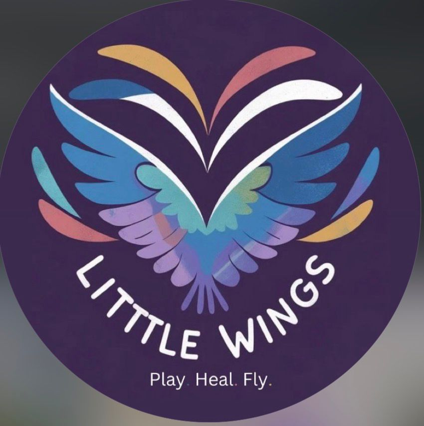

<div align="center">



# 🕊️ Little Wings

### *Play · Heal · Fly*

**Little Wings** is een webshop met een missie: voor elk product dat je koopt, gaat 100% van de winst rechtstreeks naar kinderen die getroffen zijn door oorlog over de hele wereld. Eén aankoop, echte impact.

[](https://python.org)
[](https://flask.palletsprojects.com)
[](https://sqlite.org)
[](https://docker.com)
[](https://www.instagram.com/littlewings.heal)

</div>

---

## 🌸 Over het project

Little Wings is een initiatief dat kinderen in moeilijke situaties ondersteunt. Wij geloven dat creativiteit, kunst en muziek helpen bij het helen van trauma's. Door spel, muziek en creatieve activiteiten creëren we veilige ruimtes waar kinderen zich vrij voelen.

> *"Eén uur is genoeg om de dag van een kind te veranderen."*

---

## ✨ Features

- 🛍️ **Webshop** — Browse en bestel producten uit de Little Wings collectie
- 🔍 **Zoekfunctie** — Zoek producten op naam of beschrijving direct in de shop
- 🛒 **Winkelwagen** — Voeg producten toe, pas aantallen aan en beheer je bestelling
- 💳 **Checkout met validatie** — Serverside validatie van alle adresvelden en e-mailformaat
- 📦 **Bestellingstatus** — Klanten kunnen hun bestelling terugzoeken via ordernummer en e-mail
- 📧 **Bevestigingsmail** — Klant ontvangt automatisch een HTML-mail na bestelling
- 🔑 **Wachtwoord reset** — Vergeten wachtwoord resetten via een beveiligde e-maillink
- 🌍 **Meertaligheid** — Volledige NL/EN taalwissel via één knop in de navigatiebalk
- ❤️ **Donaties** — Doneer direct via een eenvoudig formulier
- 👤 **Gebruikersaccounts** — Registreer en log in om bestellingen te plaatsen
- 🔐 **Admin dashboard** — Beheer producten (inclusief foto-upload), bestellingen en donaties
- 🖼️ **Foto-upload** — Upload productfoto's direct vanuit het admin dashboard
- 🐳 **Docker-ondersteuning** — Start de volledige app met één commando
- 🔒 **CSRF-beveiliging** — Alle formulieren zijn beveiligd tegen cross-site request forgery
- 📱 **Responsief design** — Werkt op desktop en mobiel

---

## 🚀 Opstarten met Docker (aanbevolen)

### Vereisten

- [Docker Desktop](https://www.docker.com/products/docker-desktop/)

### Stappen

**1. Clone de repository**
```bash
git clone https://github.com/Littlewingsss/Littlewings.git
cd Littlewings
```

**2. Maak een `.env` bestand aan**
```bash
cp .env.example .env
```
Pas de waarden aan in `.env` (minimaal `SECRET_KEY`). Zie de sectie [Omgevingsvariabelen](#-omgevingsvariabelen) hieronder.

**3. Bouw en start de container**
```bash
docker compose up -d --build
```

**4. Initialiseer de database (alleen eerste keer)**
```bash
docker compose exec web python -c "from app import create_app, db; app = create_app(); app.app_context().push(); db.create_all()"
docker compose exec web python db.py
```

**5. Open de app**

Ga naar [http://localhost:5001](http://localhost:5001) 🎉

### Handige Docker-commando's

```bash
docker compose up -d --build   # Herbouw en herstart (na codewijzigingen)
docker compose down            # Stop de container
docker compose logs -f         # Bekijk live logs
docker compose exec web python db.py   # Herseed de database
```

> **Foto-uploads** worden bewaard in `./app/static/img/` op je host via een volume-mount — ze blijven dus staan na een `--build`.

---

## 💻 Lokaal opstarten (zonder Docker)

### Vereisten

- Python 3.10 of hoger

### Stappen

```bash
git clone https://github.com/Littlewingsss/Littlewings.git
cd Littlewings
python -m venv .venv
source .venv/bin/activate        # Windows: .venv\Scripts\activate
pip install -r requirements.txt
cp .env.example .env             # Pas SECRET_KEY aan
python db.py                     # Initialiseer en seed de database
python run.py
```

De app is nu beschikbaar op [http://localhost:5000](http://localhost:5000).

---

## 🔧 Omgevingsvariabelen

Kopieer `.env.example` naar `.env` en vul de waarden in:

| Variabele | Beschrijving | Verplicht |
|---|---|---|
| `SECRET_KEY` | Willekeurige geheime sleutel voor sessies en CSRF | Ja |
| `MAIL_SERVER` | SMTP-server (standaard: `smtp.gmail.com`) | Nee |
| `MAIL_PORT` | SMTP-poort (standaard: `587`) | Nee |
| `MAIL_USERNAME` | E-mailadres waarmee mails worden verstuurd | Nee* |
| `MAIL_PASSWORD` | App-wachtwoord van de e-mailprovider | Nee* |
| `MAIL_DEFAULT_SENDER` | Afzenderadres (standaard gelijk aan `MAIL_USERNAME`) | Nee |

> \* Laat `MAIL_USERNAME` leeg om bevestigingsmails uit te schakelen. De app werkt gewoon door zonder e-mailconfiguratie.

**Gmail instellen:** gebruik een [App Password](https://myaccount.google.com/apppasswords) (vereist 2FA).

---

## 🗂️ Projectstructuur

```
Littlewings/
├── run.py                      # Startpunt van de applicatie
├── db.py                       # Database initialisatie en seeding
├── requirements.txt            # Python dependencies
├── Dockerfile                  # Docker image definitie
├── docker-compose.yml          # Container configuratie
├── .env.example                # Voorbeeld omgevingsvariabelen
└── app/
    ├── __init__.py             # App factory (Flask setup + extensies)
    ├── models.py               # Database modellen
    ├── forms.py                # WTForms formulieren
    ├── auth.py                 # admin_required decorator
    ├── mail.py                 # Bevestigingsmail functie
    ├── routes.py               # (vervangen door blueprints)
    ├── blueprints/
    │   ├── auth.py             # Login, register, logout, home
    │   ├── shop.py             # Shop, winkelwagen, bestelling, donaties
    │   └── admin.py            # Admin dashboard en productbeheer
    ├── static/
    │   ├── css/                # Stylesheets
    │   └── img/                # Productafbeeldingen (ook uploads)
    └── templates/
        ├── base.html               # Basis template met navigatie
        ├── welcome.html            # Welkomst- en loginpagina
        ├── home.html               # Homepagina
        ├── shop.html               # Webshop (met zoekfunctie)
        ├── winkelwagen.html        # Winkelwagen en checkout-formulier
        ├── betaal_bestelling.html  # Betaalpagina bestelling
        ├── betaal_donatie.html     # Betaalpagina donatie
        ├── doneer.html             # Donatiepagina
        ├── over_ons.html           # Over ons
        ├── bestelling_status.html  # Bestellingstatus opzoeken
        ├── wachtwoord_vergeten.html # Wachtwoord vergeten formulier
        ├── wachtwoord_reset.html   # Nieuw wachtwoord instellen
        ├── login.html              # Inloggen
        ├── register.html           # Registreren
        └── admin.html              # Beheerpaneel
└── translations/
    ├── nl/LC_MESSAGES/
    │   ├── messages.po             # Nederlandse vertaalstrings (bronstring)
    │   └── messages.mo             # Gecompileerd binair bestand
    └── en/LC_MESSAGES/
        ├── messages.po             # Engelse vertalingen (222 strings)
        └── messages.mo             # Gecompileerd binair bestand
```

---

## 🗄️ Database modellen

| Model | Beschrijving |
|---|---|
| `User` | Gebruikersaccounts met gehashte wachtwoorden |
| `Product` | Producten met naam, beschrijving, prijs, voorraad en foto |
| `Order` | Bestellingen met klantgegevens, adres en betaalmethode |
| `OrderRegel` | Individuele producten per bestelling |
| `Donatie` | Directe donaties met naam, e-mail en bedrag |

---

## 🛠️ Technologieën

| Technologie | Gebruik |
|---|---|
| [Flask](https://flask.palletsprojects.com/) | Web framework |
| [Flask-SQLAlchemy](https://flask-sqlalchemy.palletsprojects.com/) | Database ORM |
| [Flask-Login](https://flask-login.readthedocs.io/) | Gebruikersauthenticatie |
| [Flask-WTF](https://flask-wtf.readthedocs.io/) | Formuliervalidatie en CSRF-bescherming |
| [Flask-Migrate](https://flask-migrate.readthedocs.io/) | Database migraties |
| [Flask-Mail](https://pythonhosted.org/Flask-Mail/) | Bevestigingsmails |
| [Flask-Babel](https://python-babel.github.io/flask-babel/) | Meertaligheid (i18n) |
| [SQLite](https://sqlite.org/) | Database |
| [Jinja2](https://jinja.palletsprojects.com/) | HTML templates |
| [Docker](https://docker.com/) | Containerisatie |

---

## 📋 Changelog

### Recente verbeteringen

**Meertaligheid (NL/EN) via Flask-Babel**
- Volledige Nederlandse en Engelse interface — 222 strings vertaald in alle templates en Python-bestanden
- Taalwisselknop in de navigatiebalk (🇬🇧 EN / 🇳🇱 NL) — taalkeuze opgeslagen in de sessie
- Meervoudsvormen correct afgehandeld (`ngettext`)
- WTForms-labels vertaald met `lazy_gettext`; flash berichten met `_()` in alle blueprints
- Vertaalworkflow: `babel.cfg` → `pybabel extract` → `pybabel compile`

**Zoekfunctie in de shop**
- Zoekbalk bovenaan de shop om te filteren op productnaam of -beschrijving
- URL-parameter `?q=` — zoekresultaten zijn deelbaar via de URL
- Resultaatteller met optie om de zoekopdracht te wissen

**Bestellingstatus pagina**
- Klanten kunnen hun bestelling terugzoeken via ordernummer + e-mailadres (geen login vereist)
- Toont bestelregel, adresgegevens, verzend- en betaalmethode en totaalbedrag
- Bereikbaar via "Mijn bestelling" in de navigatiebalk

**Wachtwoord vergeten & reset**
- "Wachtwoord vergeten?" link op de loginpagina
- Beveiligde resetlink via e-mail (geldig 1 uur, gegenereerd met `itsdangerous`)
- E-mail enumeration voorkomen: altijd dezelfde melding tonen ongeacht of account bestaat
- Werkt automatisch mee met de bestaande MAIL-configuratie in `.env`

**Blueprints architectuur**
- `routes.py` opgesplitst in drie Flask blueprints: `auth`, `shop` en `admin`
- Betere scheiding van verantwoordelijkheden en overzichtelijkere codestructuur

**Docker-ondersteuning**
- `Dockerfile` en `docker-compose.yml` toegevoegd
- App start met één commando: `docker compose up -d --build`
- Volumes voor database (`instance/`) en foto-uploads (`app/static/img/`)

**Bevestigingsmail**
- Na elke bestelling ontvangt de klant automatisch een HTML-mail
- Bevat bestelregels, totaalbedrag inclusief verzending en bezorgadres
- Eenvoudig in te schakelen via `MAIL_USERNAME` in `.env`

**Foto-upload in admin**
- Productfoto's kunnen nu direct worden geüpload via het admin dashboard
- Ondersteunt PNG, JPG, JPEG, GIF en WEBP
- Valt terug op handmatige bestandsnaam als er geen bestand wordt geüpload

**Checkout-validatie**
- Serverside validatie van alle verplichte adresvelden
- E-mailformaatcontrole bij het plaatsen van een bestelling
- Duidelijke foutmeldingen per ontbrekend veld

**Bug fixes & beveiligingsverbeteringen**
- CSRF-tokens toegevoegd aan alle formulieren (admin, betaalpagina's, donatie)
- `Product.query.get()` vervangen door `db.session.get()` (SQLAlchemy 2.x compatibel)
- `functools.wraps` toegevoegd aan `admin_required` decorator
- Ontbrekende dependencies (`Flask-Login`, `Flask-Migrate`, `email-validator`) toegevoegd aan `requirements.txt`

---

## 🌍 Onze impact

- 💚 **100% van de winst** gaat naar kinderen in oorlogsgebieden
- 🌱 **Duurzame materialen** in alle producten
- 🚚 **Gratis verzending** op standaard bestellingen
- 🌐 **Wereldwijde impact** — elk klein gebaar telt

---

## 📱 Volg ons

Blijf op de hoogte van onze missie en zie hoe jouw steun het verschil maakt:

[](https://www.instagram.com/littlewings.heal)

---

## 🤝 Bijdragen

Wil je meehelpen? Pull requests zijn welkom! Voor grote wijzigingen, open eerst een issue om te bespreken wat je wilt veranderen.

---

<div align="center">

Gemaakt met ❤️ voor de kinderen van de wereld

**Little Wings** — *Play · Heal · Fly*

</div>
